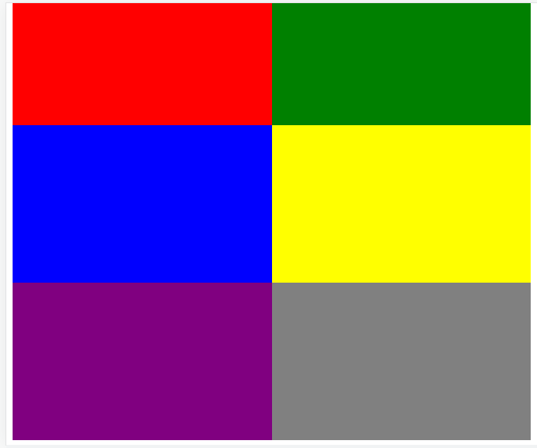

## Resume Materi Frontend Fundamental
Dalam materi ini, mempelajari tentang 3 poin penting.

# 1. Mempelajari Tentang Frontend Fundamental
Frontend Fundamental terdiri dari HTML, CSS Javascript, Node.js, NPM, dan Git.

## HTML
HTML (Hypertext Markup Language) adalah bahasa markup standar untuk membuat dan menyusun halaman dan aplikasi web. HTML digunakan untuk membuat kerangka dari sebuah web menggunakan tag-tag HTML.

### Cara Kerja HTML
File diakhiri dengan ekstensi .html atau .htm. File dengan ekstensi tersebut akan dirender oleh browser.

Ekstensi file ini bias dirender dengan menggunakan web browser apapun (seperti Google Chrome, Safari, atau Mozilla Firefox).

### HTML Tag
Sebuah file HTML terdiri atas serangkaian tags (bias disebut juga elements)
Sebagian besar elemen bahasa markup ini memiliki tag pembuka dan tag penutup yang menggunakan syntax.

Tag HTML memiliki dua tipe utama yaitu block-level dan inline tags. 

Block-level artinya tidak memperbolekan elemen lain untuk berada satu level dengan block-level, sedangkan inline tag memperbolehkan. Tiga tag block-level htnl yang harus dimiliki oleh setiap dokumen HTML adalah tag html, tag head, dan tag body.

## CSS
CSS (Cascading Style Sheets) dipakai untuk mendesain halaman depan atau tampilan website. CSS menangani tampilan dan “rasa” dari halaman website.

### Cara Kerja CSS
CSS membuat style di dalam halaman web yang dapat berinteraksi dengan elemen HTML.

### Menambahkan file CSS
Terdapat 3 cara untuk menambahkan file CSS ke dalam HTML yaitu sebagai berikut:
1.	External CSS (membuat file external css)
2.	Internal CSS (tidak perlu membuat file external css tersendiri dan tag style dapat dimasukkan ke bagian head atau body)
3.	Inline CSS (tidak perlu membuat file external css tersendiri dan tag style dapat ditambahkan pada komponen yang akan diubah tampilannya)

## Media Queries
Media queries merupakan modul CSS yang berguna membuat layoutkita responsive dengan menyesuaikan tampilan berdasarkan ukuran layer perangkat.

## Javascript
Javascript adalah script yang “membuat halaman web menjadi hidup” yang memungkinkan adanya interaksi dengan pengguna. Javascript bias ditulis langsung ke dalam kode HTML dari sebuah web dan berjalan otomatis saat halaman dimuat.

Sekarang, javascript bias berjalan tak hanya pada browser tetapi juga di server atau diperangkat manapun yang memiliki program khusus javascript engine.

### Cara Kerja Javascript

Bisa langsung menambahkan Javascript di HTML dengan menggunakan tag script
Kode JS yang bias ditambahkan yaitu di tag head dan tag body.

## Node.JS
adalah runtime environment untuk JsavaScript. dengan Node.JS kita dapat menjalankan kode JavaScript dimanapun.

### Cara Kerja Node.js
Node.js akan melakukan eksekusi atau menjalankan file yang memilki ekstensi js.

## NPM
Node Package Manager adalah commmand line yang dapat menginstal dan meng-uninstal package, mengelola versi dan depedensi yang diperlukan untuk menjalankan proyek.

### Cara Kerja NPM
Package pada Node.js memuat semua file yang dibutuhkan sebagai module. Module adlah library JavaScript yang dapat kita masukkan ke dalam proyek.

### Struktur Proyek NPM
key yang penting untuk diingat:
- **name** adalah nama proyek
- **scripts** adalah daftar perintah yang bisa jalankan di dalam proyek. Contoh: npm run test
- **dependencies** adalah daftar library yang dipakai di proyek ketika production
- **devDependencies** adalah daftar library yang dipakai di proyek ketika tahap pengembangan.

## Git
adalah salah satu sistem pengontrol versi (Version Control System) pada proyek perangkat lunak.

### Kata Kunci Penting Pada Git
1. Modified
File yang telah kita rubah, perubahan tercatat dan dapat kita bandingkan dengan versi commit sebelumnya.

2. Staged
File yang telah kita modified dan kita telah add.

3. Commit
Mengambil berkas-berkas yang ada pada staging area dan menyimpan snapshot secara tetap kedalam Git.

4. Branch
Cerminan direktori Git.

# 2. Penugasan Fronted Fundamental
Pada materi ini, kami mendapat penugasan membuat responsive suatu tampilan dan membuat branch repo baru.
Berikut screenshots dari tugas yang diberikan.

### Jika lebar lebih dari atau sama dengan 960px

### Jika lebar lebih dari atau sama dengan 600px dan kurang dari 960px

### Jika lebar kurang dari 600px

### Membuat repo baru dan branch latihan-materi-1

# 3. Kesimpulan
Untuk mempelajari Frontend, kita harus memahami HTML, CSS Javascript, Node.js, NPM, dan Git.
Kita harus mengetahui cara menggunakannya serta mengetahui dokumentasi serta kata kunci penting di dalamnya.
